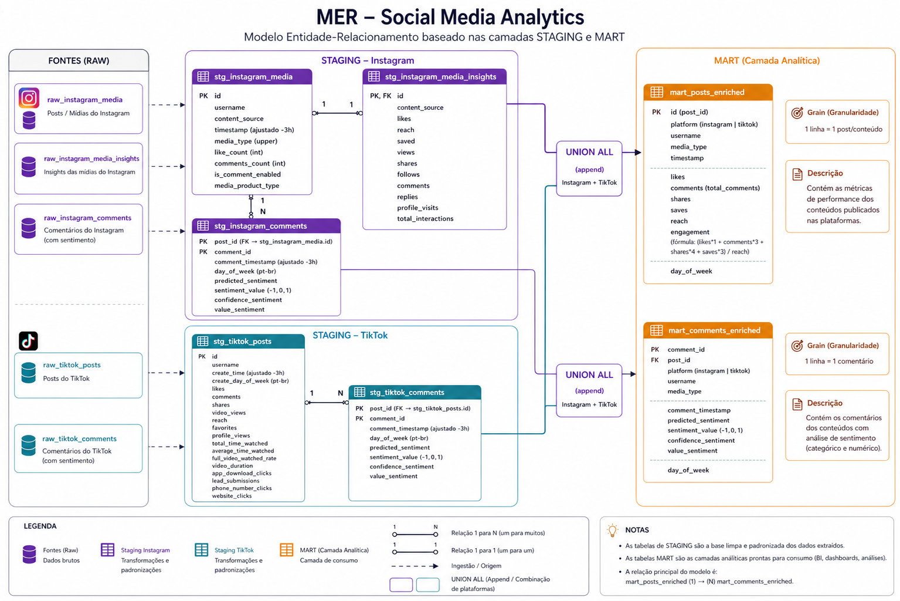
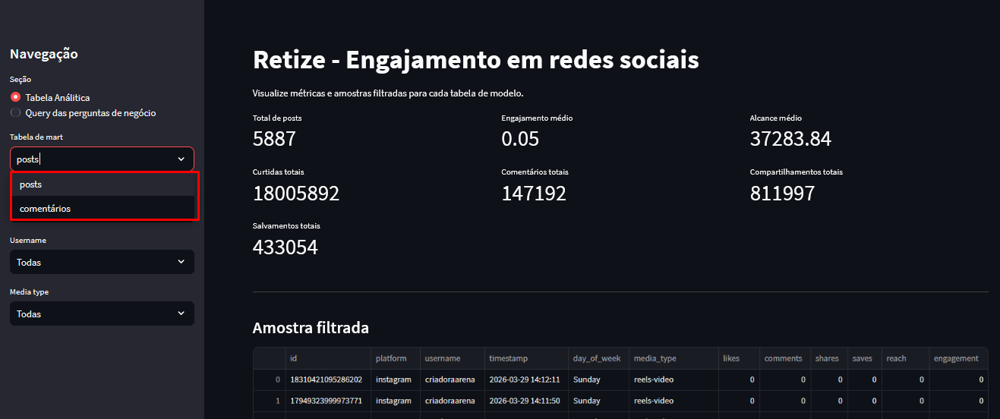
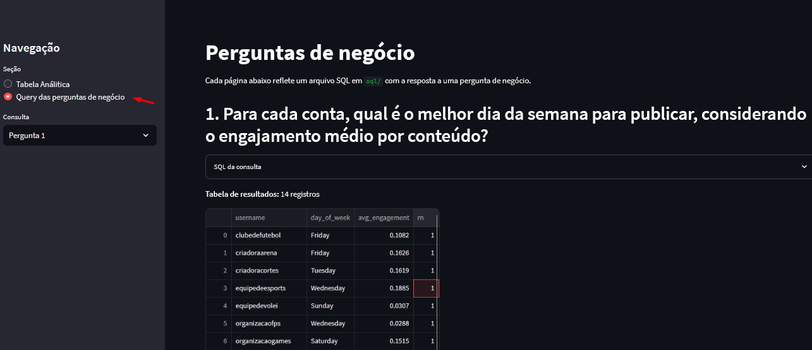

## **Visão geral da solução**

O primeiro passo foi fazer uma análise exploratória dos arquivos, entender cada coluna, como os dados estavam vindo, quais faltavam informações e erros que mais apareciam. A partir disso com as perguntas de negócios a serem respondidas foi possível começar a pensar no processo a ser seguido e na transformação e modelagem. Que seguiu um caminho focado em relacionar as métricas do Tiktok com as do Instagram para serem comparáveis, a escolha foi criar duas tabelas finais, uma de Posts e outra de Comentários, usando as fórmulas:

**Fórmula Engajamento**   
 E= \[(Curtidas × 1\) \+ (Comentários × 3\) \+ (Compartilhamentos × 4\) \+ (Salvos × 3)\] / Reach

Decidi por dar pesos a cada métrica, já que o engajamento é o quanto o usuário interage com o post, cada ação demonstra mais ou menos engajamento que a outra por exemplo um compartilhamento vale mais do que uma curtida e faz o post aparecer pra mais gente, entendo que isso pode gerar uma nota menor para storys por exemplo já que eles na maior parte só tem curtidas, e não costumam ter comentários, compartilhamentos, e nem dá pra salvar, mas o story por si só já é um tipo de post que gera um engajamento menor, então acho a pontuação justa.

**Obs:** pensei em usar novos seguidores como parte da fórmula de engajamento por mais que seja relacionada a conversão, também poderia fazer parte do engajamento, só que não achei os dados confiáveis o suficiente, existiam muitas linhas com esse valor nulo, mesmo onde eram posts do instagram com vários acessos, curtidas, o valor ali provavelmente não era zero, então optei por não utilizar

**Fórmula Sentimento:**   
 S \=\[ ( 1 ou \-1 x grau de confiança) \]

O sentimento foi calculado dando valores de \-1 (negativo), 0 (neutro), 1 (positivo) para possibilitar somar, na análise exploratória percebi que havia muitos valores entre 0,3 e 0,5, que não são confiáveis, então decidi dar um peso para que esse valores com baixa confiabilidade interferisse menos, então cheguei nessa fórmula de sentimento x grau de confiança

## **Fluxo**

**Load (Carga):**  
O código de carga é simples, ele procura os arquivos com os nomes na pasta “files” e faz a validação com o Pydantic, realizei alguns testes alterando os CSVs para garantir que a validação e o logs estão funcionando como deveriam.  
 Depois da validação a tabela raw é criada ou é feito um replace caso exista, o código possuí idempotência podendo ser rodado várias vezes sem alterar o resultado final.

Pontos importantes que foram pensados no código da carga: logs bem estruturados para boa observabilidade, idempotência e qualidade dos dados garantidos por uma boa validação.

**Transform (DBT):** para criar as views stg\_ e tabelas mart, também foi feito os testes aqui, mas de forma mais simples (dei preferência a validação completa pelo Pydantic)

**Apresentação:** feita pelo Streamlit, em um único arquivo.

## **Ambiente e Como Rodar**

Para preparar o ambiente, necessário o Docker Desktop

Subir banco, na pasta do docker-compose.yml, rodar no terminal:   
docker-compose up \-d

Ativar Venv:   
python \-m venv .venv   
.venv\\Scripts\\activate 

Instalar libs:  
pip install \-r requirements.txt 

Rodar orquestrador.py:  
python [orquestrador.py](http://orquestrador.py)

Também é possível rodar individualmente, src/[ingestion.py](http://ingestion.py) e na pasta dbt rodar o dbt run

Depois de rodar o orquestrador ou rodar o streamlit run streamlit\_app.py, ele fica disponível em: [http://localhost:8501/](http://localhost:8501/)

as querys estão disponíveis na pasta queries, e estarão sendo rodadas no streamlit

caso queira rodar no DBeaver ou algum outro software, esses são os dados para acessar o banco  

DB\_CONFIG \= {  
    "host": "localhost",  
    "port": 5432,  
    "database": "retize\_dw",  
    "user": "retize",  
    "password": "retize\_password"  
}

## **Transformação e modelagem**

Sobre a modelagem, após a análise exploratória e entender as perguntas do negócio, reparei que seria possível criar uma métrica de engajamento igual para o TikTok e para o Instagram sem perder qualidade. A palavra principal do negócio é **Engajamento** que é a interação que o usuário tem com aquele conteúdo, é diferente de Alcance e Conversão, que são medidas interessantes e que daria pra criar, mas não é o foco das perguntas. Optei por criar duas tabelas finais, uma para **Comentários** e outra para **Posts**, e nelas conteriam juntos os dados do Instagram e do TikTok já algumas das perguntas são comparações entre essas plataformas. 

O foco ficou nas métricas presentes em ambas plataformas e nas, como likes, compartilhamentos, salvos, alcance,comentários, e que fizessem parte das fórmulas criadas para medir o engajamento e sentimento, as duas tabelas finais foram o resultado disso.

**Camada Raw** \- Para as tabelas raw na hora da carga fiz a remoção de linhas totalmente nulas, duplicadas, registros com valores essenciais nulos (ex: id) e testes de integridade dos dados

**Camada Stage** \- Ajuste de timezone, no csv era UTC, mas no Brasil nosso horário é UTC-3, criação da coluna dia da semana, importante para responder perguntas de negócio, criação da métricas de valores do sentimento e do cálculo do sentimento dos comentários

**Camada Mart** \- Junção entre Tiktok e Instagram, padronização de nome de colunas entre as plataformas, criação da coluna media\_type, cálculo da métrica de engajamento, coalesce para garantir que em algumas colunas nulos deviam ser 0 para não afetar cálculos 

**Escolhas e Trade offs:** Os arquivos de comentários possuíam poucas colunas e todas com informações importantes que foram usadas como parte da tabela mart de comentários. Já os outros arquivos para a tabela mart de post possuíam mais informações, com valor de análise interessante. Para escolher quais colunas eu iria usar comecei pelas que as que indicavam informações sobre o conteúdo, id, data, tipo de arquivo, nome da conta, informações indispensáveis, depois fui para as que respondiam às perguntas de negócio, que são as métricas de engajamento: curtidas, salvos, compartilhamentos, comentários, alcance, aqui não utilizei a coluna view por falta de confiabilidade, valores faltando, e a coluna reach supria bem a ausência da view. Com isso já tinha uma base sólida e confiável para uma tabela final, e verificando as outras colunas eram métricas importantes porém não essenciais para as perguntas de negócio, a não ser que fosse criar uma métrica de engajamento diferente e mais complexa e também essa colunas não eram confiáveis, com muitos valores nulos onde claramente não deveria ser e outras com valores zerados em mais de 90% das linhas o que também trás uma certa desconfiança e diminui a possibilidade de uso 

### **Melhorias**

Caso tivesse acesso a parte da extração identificaria melhor quais métricas que não foram utilizadas e poderiam ter sido. Exemplo as colunas Views, Followers, Tempo de vídeo assistido, possuem grande valor, mas pareciam estar faltando dados em alguns casos, com isso sendo corrigido daria pra criar Indicadores interessantes com Alcance/Views (para saber quantos re-assistem) Alcance  por horário e tipo de conteúdo, de Conversão (quantas pessoas assistiram e viram o perfil ou resolveram seguir) Retenção de Atenção (tempo de vídeo assistido, porcentagem que terminou de ver, etc).

### **Uso de IA**

 Foi usada para entender o negócio, tirar dúvidas, no código, para auxiliar em algumas partes na sintaxe de Python e SQL (em trechos para adaptar) e com bugs e erros, para facilitar na criação do arquivo Streamlit. Não foi usado na documentação (só para o esquema MER e quadro de qualidade de dados), nem para tomar decisões sozinho e gerar código inteiro sozinho  
 

## **Qualidade dos dados**

Foram feitas verificações se o campo vinha com valor ou se nessa coluna é opcional, foi feito delete de linhas duplicadas, padronização de entrada em string e tudo minúsculo onde for campos com letras, depois o parse(conversão) para o tipo correto, int, float, bool e validação se deu certo a conversão

Houve erros de formatos, muitos dados como IDs vinham como string e não dava pra validar como int, assim como os datetime, mas com pydantic usando funções de parse, deixei eles virem como string porém passando a validação no @field\_validator, com por exemplo garantir que um id seja um dígito 

Foram feitos testes para ver se a validação estava funcionando, testei alterando um campo por linha, os testes foram:  
validação de valores diferentes do tipo da coluna, como adicionar letra em campo int, e só um número em campo string  
validação em  campos que não deviam ser nulos   
validação se em campos que vem valores esperados de string aceitam valores diferentes dos esperados  
validação se o campo id vem só com números  
validação se o sentimento vem com o nome correto  
validação se confidence vem com valor de 0 a 1  
validação se no campo booleano aceita algo diferente de 1, 0, true ou false

Todos os testes funcionaram e as validações estão ok, assim como os logs que ajudaram no processo de correção do código

## **Tabelas de regras usadas na validação**

**`instagram_media.csv`** 

| Coluna | Tipo | Tratamento / Regra de Validação |
| :---- | :---- | :---- |
| content\_source | string | Normalizado via normalize\_str. Deve ser obrigatoriamente media ou story. |
| id | string | Convertido para string e validado via .isdigit(). Erro se contiver letras. |
| username | string | Normalizado via normalize\_str. Não pode ser nulo. |
| timestamp | datetime | Processado pela função parse\_datetime\_utc(v). |
| like\_count | integer | Opcional. Tratado via parse\_int(v). |
| media\_type | string | Normalizado; aceita apenas: carousel\_album, image ou video. |
| comments\_count | integer | Opcional. Tratado via parse\_int(v). |
| is\_comment\_enabled | boolean | Tratado via parse\_bool(v). Garante o retorno estrito de um booleano. |
| media\_product\_type | string | Normalizado; aceita apenas: reels, story ou feed. |

**`instagram_media_insights.csv`** 

| Coluna | Tipo | Tratamento / Regra de Validação |
| :---- | :---- | :---- |
| content\_source | string | Normalizado. Deve ser media ou story. |
| id | string | Convertido para string e validado via .isdigit(). |
| likes até total\_interactions | integer | Todos os campos numéricos são opcionais e tratados via parse\_int(v). |

**`instagram_comments.csv`** 

| Coluna | Tipo | Tratamento / Regra de Validação |
| :---- | :---- | :---- |
| social\_media | string | Normalizado. Deve ser obrigatoriamente instagram. |
| post\_id | string | Convertido para string e validado via .isdigit(). |
| comment\_id | string | Convertido para string e validado via .isdigit(). |
| comment\_timestamp | datetime | Processado pela função parse\_datetime\_utc(v). |
| predicted\_sentiment | string | Normalizado; aceita apenas: positivo, neutro ou negativo. |
| confidence\_sentiment | float | Tratado via parse\_float(v). Deve estar obrigatoriamente entre 0 e 1\. |

**`tiktok_posts.csv`** 

| Coluna | Tipo | Tratamento / Regra de Validação |
| :---- | :---- | :---- |
| item\_id | string | Convertido para string e validado via .isdigit(). |
| create\_time | datetime | Processado pela função parse\_datetime\_utc(v). |
| business\_username | string | Removido espaços (strip), validado para não ser nulo nem puramente numérico, e normalizado. |
| likes até website\_clicks | integer | Opcionais. Tratados via parse\_int(v). |
| average\_time\_watched | float | Opcional. Tratado via parse\_float(v). |
| full\_video\_watched\_rate | float | Opcional. Tratado via parse\_float(v). |
| video\_duration | float | Opcional. Tratado via parse\_float(v). |

**`tiktok_comments.csv`** 

| Coluna | Tipo | Tratamento / Regra de Validação |
| :---- | :---- | :---- |
| social\_media | string | Normalizado. Deve ser obrigatoriamente tiktok. |
| post\_id | string | Convertido para string e validado via .isdigit(). |
| comment\_id | string | Convertido para string e validado via .isdigit(). |
| comment\_timestamp | datetime | Processado pela função parse\_datetime\_utc(v). |
| predicted\_sentiment | string | Normalizado; aceita apenas: positivo, neutro ou negativo. |
| confidence\_sentiment | float | Tratado via parse\_float(v). Deve estar entre 0 e 1\. |

### **Apresentação pelo Streamlit**

Ele gera uma visão geral de soma de algumas métricas, em **Tabela Análitica,** podendo selecionar entre as duas tabelas marts e adicionar filtros, como username e media type, também é possível ver as repostas das perguntas na opção de **Query das perguntas de negócio**.

